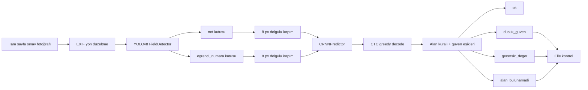
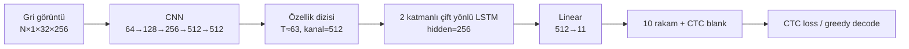
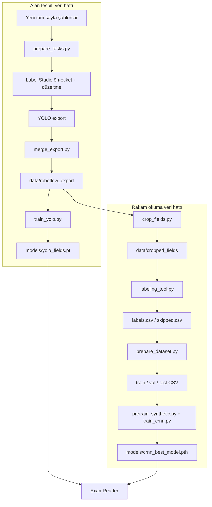
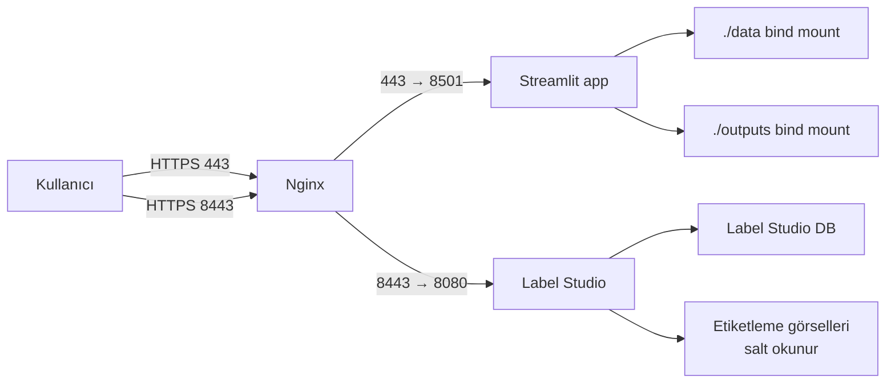

# OCR Sınav Crop CRNN — Proje Yapısı İnceleme Raporu

> İnceleme tarihi: 22 Temmuz 2026  
> Kapsam: kaynak kodlar, eğitim ve çıkarım akışları, veri klasörleri, model dosyaları, Streamlit/Label Studio arayüzleri, Docker/Nginx dağıtımı ve mevcut dokümantasyon.

## 1. Yönetici özeti

Bu proje, tam sayfa sınav fotoğrafından iki alanı okumak için kurulmuş iki aşamalı bir OCR sistemidir:

1. **YOLOv8**, sayfadaki `not` ve `ogrenci_numara` bölgelerini bulur.
2. **CRNN (CNN + 2 katmanlı BiLSTM + CTC)**, bulunan kırpımlardaki rakam dizilerini okur.

Sistem yalnızca model kodundan ibaret değildir. Aynı depoda veri kırpma, rakam etiketleme, Label Studio ile kutu etiketleme, sentetik veri üretme, model eğitme, değerlendirme, web arayüzü ve VPS dağıtımı da bulunur. Bu nedenle proje üç ana iş hattı içerir:

- **Ürün hattı:** tam sayfa → alan tespiti → kırpım → rakam okuma → güven/doğrulama kararı.
- **CRNN veri hattı:** YOLO etiketli sayfa → alan kırpımları → rakam etiketi → split → CRNN eğitimi.
- **YOLO veri hattı:** yeni şablon → Label Studio kutuları → YOLO veri seti → YOLO eğitimi.

Mevcut depoda çalıştırılabilir model ağırlıkları ve CRNN verisi vardır. Ancak YOLO'nun ham tam-sayfa veri seti olan `data/roboflow_export/` `.gitignore` kapsamındadır ve bu çalışma kopyasında yoktur. Dolayısıyla mevcut ağırlıklarla çıkarım yapılabilir; YOLO'yu aynı ham veriyle yeniden üretmek için ayrıca bu klasör gerekir.

## 2. Sistemin büyük resmi



Ana çalışma zamanı sınıfı [`ExamReader`](inference/pipeline.py)'dır. Bu sınıf [`FieldDetector`](inference/detector.py) ile [`CRNNPredictor`](inference/predictor.py) bileşenlerini bir araya getirir.

## 3. Mevcut içerik ve sayısal envanter

| Varlık | Mevcut durum |
|---|---:|
| Kırpılmış JPG | 2.200 |
| `not` kırpımı | 1.098 |
| `ogrenci_numara` kırpımı | 1.102 |
| Etiketli CRNN satırı | 2.194 |
| Atlanmış/okunamaz kayıt | 17 |
| İşlenmiş eğitim satırı | 1.535 (%70) |
| İşlenmiş doğrulama satırı | 220 (%10) |
| İşlenmiş test satırı | 439 (%20) |
| JPG toplam boyutu | yaklaşık 25,39 MB |
| CSV toplam boyutu | yaklaşık 1,43 MB |
| CRNN en iyi model | 24,25 MB |
| CRNN ön-eğitim modeli | 24,25 MB |
| YOLO alan modeli | 21,52 MB |

`data/raw/labels.csv` içindeki alan dağılımı oldukça dengeli görünür: 1.098 öğrenci numarası ve 1.096 not kaydı. Orijinal `split` sütununda 1.781 `train`, 223 `valid`, 190 `test` kaydı vardır; ancak `prepare_dataset.py` bunları tekrar rastgele böler.

Model checkpoint incelemesinde:

- `crnn_best_model.pth`, 267 indeksli epoch'ta kaydedilmiş; bu kullanıcı açısından 268. epoch'tur.
- Checkpoint doğrulama tam-sekans doğruluğu `0,9318` (%93,18) olarak kayıtlıdır.
- Model state yaklaşık **6,35 milyon öğrenilebilir değer** içerir.
- Bu oran doğrulama metriğidir; depoda güncel bağımsız test raporu bulunmadığından nihai ürün doğruluğu olarak yorumlanmamalıdır.

## 4. Klasör ağacı

```text
OCR_Sinav_Crop_CRNN/
├── .claude/                 # Yerel Streamlit başlatma tanımı
├── configs/                 # CRNN eğitim ayarları
├── data/
│   ├── raw/                 # Birleştirme öncesi/ham rakam etiketleri
│   ├── processed/           # CRNN train/val/test CSV'leri
│   ├── cropped_fields/      # not ve öğrenci numarası kırpımları
│   ├── crnn_dataset/        # Ana etiket ve skipped CSV'leri
│   └── metadata/            # Şu anda yalnızca yer tutucu
├── inference/               # YOLO + CRNN çalışma zamanı
├── models/                  # Üç dağıtılabilir model ağırlığı
├── nginx/                   # TLS reverse proxy şablonu
├── notebooks/               # Colab YOLO eğitim notebook'u
├── outputs/                 # Kırpma ve HEIC dönüştürme raporları
├── scripts/
│   ├── labelstudio/         # Kutu etiketleme hazırlama/birleştirme
│   └── pages/               # Streamlit çoklu sayfaları
├── training/                # CRNN/YOLO eğitim ve değerlendirme
├── utils/                   # Eğitim grafikleri ve metin raporu
├── Dockerfile
├── docker-compose.yml
├── docker-compose.prod.yml
└── rehber ve kurulum dosyaları
```

`.gitignore` nedeniyle çalışma sırasında oluşan `logs/`, `data/roboflow_export/`, `data/synthetic_templates/`, Label Studio veritabanı ve görev görselleri depoya girmez. Buna karşılık üç nihai model dosyası istisna kurallarıyla repoda tutulur.

## 5. Çıkarım hattı

### 5.1 Alan tespiti

[`inference/detector.py`](inference/detector.py):

- Varsayılan model: `models/yolo_fields.pt`.
- Varsayılan algılama eşiği: `0.25`.
- Yalnızca `not` ve `ogrenci_numara` sınıflarını kabul eder.
- Bir sınıftan birden çok kutu gelirse en yüksek güvenli olanı seçer.
- Telefon fotoğraflarındaki EXIF yönünü uygular.
- Eğitim kırpımlarıyla tutarlılık için kutuya dört yönde 8 piksel ekler.

### 5.2 Rakam okuma

[`inference/predictor.py`](inference/predictor.py):

- Varsayılan model: `models/crnn_best_model.pth`.
- Çıkarımı varsayılan olarak CPU üzerinde yapar.
- Görseli gri tona ve checkpoint'teki `32×256` boyutuna dönüştürür.
- CTC greedy decode ile ardışık tekrarları birleştirir ve blank sınıfını atar.
- Güveni, decode edilen karakterlerin seçili zaman adımı olasılıklarının ortalaması olarak hesaplar.

### 5.3 Karar kuralları

[`inference/pipeline.py`](inference/pipeline.py) şu kuralları uygular:

| Alan | Geçerlilik kuralı |
|---|---|
| Öğrenci numarası | Yalnız rakam, 5–15 hane |
| Not | Yalnız rakam, 0–100 |

| Eşik | Değer |
|---|---:|
| Minimum CRNN okuma güveni | 0,80 |
| Minimum YOLO kutu güveni | 0,50 |

Algılama `0,25` üzerinde kutu üretebilir; `ExamReader` ise `0,50` altındaki kutuyu yine gösterir fakat `dusuk_guven` olarak işaretler. Bu, tamamen kaybetmek yerine kullanıcıya kontrollü doğrulama imkânı verir.

## 6. CRNN mimarisi



CNN yüksekliği 32'den 1'e indirirken genişliği daha yavaş küçültür. Böylece yatay eksen zaman dizisine dönüşür. BiLSTM hem soldan sağa hem sağdan sola bağlamı kullanır. Son katmandaki 11 sınıf, `0–9` rakamları ve CTC blank sınıfıdır.

Önemli eğitim davranışları:

- CTC loss özellikle MPS uyumluluğu için CPU'da hesaplanır.
- Gradient normu 5,0 ile sınırlandırılır.
- En iyi checkpoint doğrulama tam-sekans doğruluğuna göre seçilir.
- `ReduceLROnPlateau`, doğrulama loss'u iyileşmezse öğrenme oranını azaltır.
- Eğitim verisinde küçük affine dönüşüm ve parlaklık/kontrast artırımı vardır.

## 7. Veri ve eğitim yaşam döngüsü



### Gerçek kırpım örnekleri

| Öğrenci numarası alanı | Not alanı |
|---|---|
|  |  |

Bu iki görsel aynı sınav sayfasından üretilmiş iki farklı sınıf kırpımını temsil eder. CRNN, alan türünden bağımsız biçimde her ikisini de rakam dizisi olarak çözer; alan türü doğrulaması daha sonra pipeline içinde yapılır.

## 8. Dosya dosya inceleme

### 8.1 Kök dosyalar

| Dosya | Görevi ve gözlem |
|---|---|
| [README.md](README.md) | Hızlı tanıtım, eğitim ve klasör yapısı. Bazı sayılar ve hiperparametreler güncel kodla uyuşmuyor. |
| [QUICK_START.md](QUICK_START.md) | Üç adımlı kurulum/eğitim/değerlendirme özeti. Buradaki 50 epoch ve 0.001 LR güncel config'ten eski. |
| [TRAINING_GUIDE.md](TRAINING_GUIDE.md) | Ayrıntılı CRNN eğitim rehberi, sorun giderme ve donanım notları. Bazı metrik açıklamaları eski sınıflandırma yaklaşımından kalmış. |
| [LABELING.md](LABELING.md) | Label Studio kurulumu, ekip iş bölümü, kutu standardı, export ve yeniden eğitim akışı. Operasyonel olarak en ayrıntılı belgelerden biri. |
| [DEPLOY.md](DEPLOY.md) | VPS, TLS, Compose, durdur/başlat ve geri dönüş prosedürü. `stop` kullanımıyla veri/servis korunmasına odaklanır. |
| [requirements.txt](requirements.txt) | PyTorch, torchvision, OpenCV, pandas, Pillow/HEIC, Streamlit, sklearn, Paramiko ve Ultralytics bağımlılıkları. Sürümler yalnız alt sınırla tanımlı. |
| [setup_environment.sh](setup_environment.sh) | macOS/Linux venv kurulumu, paket yükleme, split kontrolü ve veri sayımı. |
| [setup_environment.bat](setup_environment.bat) | Windows eşdeğeri; `python` kullanır. |
| [Dockerfile](Dockerfile) | Python 3.11 slim, CPU PyTorch, proje kopyası ve Streamlit etiketleme uygulaması. |
| [docker-compose.yml](docker-compose.yml) | Yerel Streamlit ve Label Studio servisleri; Label Studio yalnız `127.0.0.1:8080` üzerinden açılır. |
| [docker-compose.prod.yml](docker-compose.prod.yml) | App + Label Studio + Nginx üretim topolojisi; veri klasörlerini bind mount eder. |
| [.env.example](.env.example) | Yalnız `DOMAIN=example.com` şablonu. |
| [.dockerignore](.dockerignore) | Eğitim verisini, notebook'ları, çıktı ve yerel dosyaları Docker build bağlamından çıkarır. |
| [.gitignore](.gitignore) | Büyük/yerel veriyi ve logları dışlar; üç model ağırlığını özellikle dahil eder. |

### 8.2 `inference/`

| Dosya | Görevi |
|---|---|
| [detector.py](inference/detector.py) | YOLO modelini yükler, iki alanı tespit eder, en iyi kutuyu seçer ve kırpar. |
| [predictor.py](inference/predictor.py) | CRNN checkpoint'ini yükler, tek kırpımı normalize eder, rakam ve güven üretir. |
| [pipeline.py](inference/pipeline.py) | İki modeli uçtan uca birleştirir; alan kuralları ve manuel kontrol durumlarını üretir. |
| [__init__.py](inference/__init__.py) | Paketi tanımlar; ek dışa aktarım mantığı yoktur. |

### 8.3 `training/`

| Dosya | Görevi |
|---|---|
| [train_crnn.py](training/train_crnn.py) | Dataset, CRNN mimarisi, CTC loss, augmentation, eğitim/doğrulama döngüsü, checkpoint ve geçmiş kaydı. |
| [prepare_dataset.py](training/prepare_dataset.py) | Ham CSV'leri birleştirir, resim/etiket doğrular, dosya adına göre tekrarları atar ve %70/%10/%20 split üretir. |
| [evaluate_model.py](training/evaluate_model.py) | Kırpılmış test setinde exact-match accuracy, CER ve alan-türü kırılımı üretir. |
| [evaluate_pipeline.py](training/evaluate_pipeline.py) | Tam sayfa testlerinde YOLO + CRNN uçtan uca doğruluğunu ölçer. |
| [synthetic_dataset.py](training/synthetic_dataset.py) | MNIST rakamlarından değişken uzunluklu, gürültü ve yerleşim çeşitliliği olan sentetik şeritler üretir. |
| [pretrain_synthetic.py](training/pretrain_synthetic.py) | CRNN'i epoch başına 20.000 sentetik şeritle 15 epoch ön-eğitir; gerçek validation CER'sine göre checkpoint seçer. |
| [train_yolo.py](training/train_yolo.py) | YOLOv8s'i 960 px, 300 epoch ve güçlü konumsal augmentation ile eğitir; isteğe bağlı sentetik sayfaları yalnız train'e ekler. |
| [run_full_pipeline.py](training/run_full_pipeline.py) | VPS indirme → split → CRNN eğitim → değerlendirme adımlarını menüyle çalıştırır. |
| [download_from_vps.py](training/download_from_vps.py) | Paramiko/SFTP ile CSV indirir ve isteğe bağlı birleştirir. |
| [__init__.py](training/__init__.py) | Eğitim paketini tanımlar. |

### 8.4 `scripts/`

| Dosya | Görevi |
|---|---|
| [convert_heic_to_jpg.py](scripts/convert_heic_to_jpg.py) | Roboflow split'lerindeki HEIC/HEIF dosyalarını JPG'ye çevirir ve raporlar. Mevcut logda 42/42 dönüşüm başarılıdır. |
| [crop_fields.py](scripts/crop_fields.py) | YOLO etiketlerini piksel kutularına çevirir, sınıf başına en iyi/tek kutuyu seçer ve 8 px dolguyla kırpar. |
| [crop_new_to_pending.py](scripts/crop_new_to_pending.py) | Daha önce işlenmemiş tam sayfaları bulup ana sete dokunmadan `cropped_fields_pending` altına kırpar. |
| [merge_pending_data.py](scripts/merge_pending_data.py) | Kontrol edilen pending kırpım/CSV'lerini yedek alarak ana veri setine taşır ve birleştirir. |
| [labeling_tool.py](scripts/labeling_tool.py) | Ana Streamlit uygulaması; sabit hash ile dört kişiye görev dağıtır, değer doğrular, etiket/skipped CSV'lerini atomik değiştirmeyle yazar. |
| [read_exams.py](scripts/read_exams.py) | Bir veya çok sayfa/folder girdisini `ExamReader` ile işler ve toplu CSV çıktısı üretir. |
| [generate_synthetic_templates.py](scripts/generate_synthetic_templates.py) | Gerçek el yazısı kırpımlarını farklı sahte sınav sayfalarına yerleştirip YOLO formatında sentetik tam-sayfa veri üretir. |

### 8.5 `scripts/labelstudio/`

| Dosya | Görevi |
|---|---|
| [prepare_tasks.py](scripts/labelstudio/prepare_tasks.py) | HEIC dahil yeni görselleri normalize eder, 1.600 px sınırlar, mevcut YOLO ile ön-etiketler ve Label Studio görev JSON'u üretir. |
| [merge_export.py](scripts/labelstudio/merge_export.py) | Label Studio YOLO export'unu sınıf indekslerini güvenle yeniden eşleyerek deterministik train/valid/test klasörlerine katar. |
| [label_config.xml](scripts/labelstudio/label_config.xml) | `not=0`, `ogrenci_numara=1` sırasını koruyan iki bounding-box etiketi ve durum seçenekleri. |

### 8.6 Streamlit sayfaları

| Dosya | Görevi |
|---|---|
| [1_🔍_Model_Testi.py](scripts/pages/1_🔍_Model_Testi.py) | Tek kırpımda CRNN tahminini test eder; pending veri için doğru etiketi geri kaydetme akışı da içerir. |
| [2_📄_Sınav_Okuma.py](scripts/pages/2_📄_Sınav_Okuma.py) | Tam sayfa yükleme, YOLO kutularını çizme, iki alanın değeri/güveni/durumunu gösterme. |

### 8.7 Diğer klasörler

| Yol | Görevi |
|---|---|
| [configs/training_config.yaml](configs/training_config.yaml) | Aktif CRNN ayarları: 32×256, hidden 256, 300 epoch, batch 32, LR 0.0003, worker 0. |
| [utils/visualization.py](utils/visualization.py) | Loss/accuracy grafikleri, confusion matrix, örnek tahmin kolajı ve eski biçimli özet rapor yardımcısı. |
| [notebooks/train_yolo_colab.ipynb](notebooks/train_yolo_colab.ipynb) | Sekiz hücreli Colab akışı: GPU kontrolü, Ultralytics kurulumu, Drive verisi, eğitim, test ve ağırlık indirme. |
| [.claude/launch.json](.claude/launch.json) | `labeling-app` için 8501 portlu yerel başlatma tanımı; Unix `.venv/bin/streamlit` yolunu kullanır. |
| `models/` | `crnn_pretrained.pth`, `crnn_best_model.pth`, `yolo_fields.pt`. |
| `outputs/logs/` | `crop_report.csv` ve `heic_conversion_report.csv`; eğitim logları burada değil, git dışı `logs/` altında üretilir. |
| `data/metadata/` ve `outputs/.gitkeep` | Boş klasörlerin sürüm kontrolünde kalmasını sağlayan yer tutucular. |

## 9. Web ve dağıtım mimarisi



Üretimde Nginx 80'i 443'e yönlendirir, Streamlit'i 443'ten ve Label Studio'yu ayrı 8443 portundan sunar. TLS sertifikaları host üzerindeki Let's Encrypt klasöründen salt okunur bağlanır. App container'ı GPU kullanmaz; Dockerfile CPU PyTorch kurar.

## 10. Güçlü yönler

- Eğitim ve çıkarımda aynı 8 px kırpım dolgusu bilinçli şekilde korunmuş.
- EXIF yön düzeltmesi hem tespit hem tam sayfa arayüzünde uygulanıyor.
- YOLO sınıf sırası birden fazla yerde açıkça sabitlenmiş ve export birleşiminde yeniden eşleniyor.
- Yeni veriler önce `pending` alana gidiyor; ana veri seti doğrudan kirletilmiyor.
- CSV yazımı geçici dosya + replace ile yapılıyor ve tek süreç içi eşzamanlı yazım kilitleniyor.
- Sentetik YOLO verisi doğrulama/teste karıştırılmıyor.
- CRNN için tam-sekans doğruluğu ve CER ayrı ölçülüyor.
- Modeller repoda hazır olduğu için VPS `git pull` sonrası doğrudan servis verebiliyor.

## 11. Dikkat edilmesi gereken bulgular

### Yüksek öncelik

1. **CRNN split'i sayfa bazlı değil, kırpım bazlıdır.**  
   `prepare_dataset.py`, `not` ve `ogrenci_numara` kırpımlarını bağımsız satırlar olarak rastgele böler. Aynı sınav sayfasının not kırpımı train'e, öğrenci numarası kırpımı test'e düşebilir. Ortak kâğıt, kamera, yazı ve şablon özellikleri veri sızıntısı oluşturup test skorunu iyimser gösterebilir. Split, Roboflow hash'inden önceki orijinal sayfa kimliğine göre grup bazlı yapılmalıdır.

2. **Canlı Streamlit etiketleme uygulamasında uygulama içi kimlik doğrulama görünmüyor.**  
   Nginx 443 üzerinden uygulamayı yayınlıyor; kodda kullanıcı doğrulaması yok, etiketçi seçimi arayüzden yapılabiliyor. Alan adı internete açıksa yetkisiz veri değişikliği riski vardır. Reverse proxy kimlik doğrulaması, VPN/IP kısıtı veya uygulama oturumu eklenmelidir.

3. **Tam sayfa YOLO veri kaynağı repoda yoktur.**  
   `data/roboflow_export/` bilinçli olarak git dışıdır. Bu iyi bir boyut politikasıdır fakat yedekleme/versiyonlama ayrı yapılmazsa YOLO yeniden üretilebilirliği ve `evaluate_pipeline.py` çalışması kaybolur.

### Orta öncelik

4. **Dokümantasyon güncel ayarlardan sapmış.**  
   README 1.598 etiketli görüntü, 32×128 giriş, 50 epoch ve 0.001 LR söylerken mevcut veri 2.194 etiket, config 32×256, 300 epoch ve 0.0003 LR içeriyor. `QUICK_START.md` ve `TRAINING_GUIDE.md` içinde de eski değerler vardır.

5. **Config'teki bazı alanlar etkin kodu yönetmiyor.**  
   `cnn_channels`, `optimizer`, `scheduler`, `pin_memory`, `verbose` ve `save_best_only` tanımlı olsa da model/loader/eğitim seçimlerinin bir kısmı kodda sabittir. Config değiştirildiğinde beklenen davranışın oluşmaması mümkündür.

6. **CRNN güven skoru kalibre edilmiş sekans olasılığı değildir.**  
   Skor yalnız decode edilen karakter zaman adımlarının ortalamasıdır; blank'leri, alternatif yolları ve sekans uzunluğunu tam temsil etmez. `0.80` eşiği, gerçek validation/test üzerinde güven-doğruluk eğrisiyle kalibre edilmelidir.

7. **`evaluate_pipeline.py` boş sonuçta hata verebilir.**  
   Hiç detay satırı oluşmazsa CSV başlıkları `detail_rows[0]` üzerinden alınırken `IndexError` oluşur. Sabit field listesi kullanılmalıdır.

8. **Windows akışında komut adı tutarsızdır.**  
   Windows kurulum script'i `python` kullanırken `run_full_pipeline.py` alt süreçleri `python3` ile çağırır. Standart Windows kurulumunda `python3` alias'ı olmayabilir.

9. **VPS SSH host anahtarı otomatik kabul ediliyor.**  
   `download_from_vps.py`, `AutoAddPolicy` kullanır. Kolaylık sağlar ancak ilk bağlantıda sunucu kimliği doğrulanmadığından ortadaki adam riskine açıktır.

### Düşük öncelik / bakım

10. `utils/visualization.py` içindeki confusion matrix fonksiyonu `labels` parametresini eksen etiketlerine uygulamıyor; aynı dosyadaki precision/recall/F1 metin raporu da güncel sekans OCR değerlendirmesiyle uyumlu değil.
11. `.claude/launch.json` yalnız Unix venv yolunu kullanıyor; mevcut Windows çalışma alanında `.venv/Scripts/streamlit.exe` gerekir.
12. Otomatik test klasörü bulunmuyor. Python kaynakları `compileall` ile sözdizimi açısından başarıyla doğrulandı, ancak regresyon testleri yok.
13. `requirements.txt` yalnız minimum sürümler kullanır. Özellikle PyTorch, torchvision, Ultralytics ve Streamlit güncellemelerinde davranış değişebilir; üretim için lock/pin önerilir.

## 12. Çalıştırma haritası

| Amaç | Komut |
|---|---|
| Yerel kurulum (Windows) | `setup_environment.bat` |
| Yerel kurulum (macOS/Linux) | `bash setup_environment.sh` |
| Streamlit etiketleme | `streamlit run scripts/labeling_tool.py` |
| CRNN split üretme | `python training/prepare_dataset.py` |
| CRNN ön-eğitim | `python training/pretrain_synthetic.py` |
| CRNN ince ayar | `python training/train_crnn.py` |
| Kırpım bazlı CRNN değerlendirme | `python training/evaluate_model.py` |
| YOLO eğitimi | `python training/train_yolo.py` |
| Uçtan uca tam sayfa değerlendirme | `python training/evaluate_pipeline.py` |
| Tek/toplu sınav okuma | `python scripts/read_exams.py <girdi>` |
| Yerel Docker | `docker compose up --build` |
| Üretim Docker | `docker compose -f docker-compose.prod.yml up -d --build` |

## 13. Sonuç

Proje, prototip seviyesinin ötesinde; veri toplama ve kalite kontrolünden iki modelin eğitimine, web arayüzüne ve VPS dağıtımına kadar tamamlanmış bir OCR ürün hattıdır. Mimari ayrımı nettir: YOLO **nerede**, CRNN **ne yazıyor** sorusunu çözer. En önemli teknik iyileştirme alanı CRNN split'ini orijinal sayfa bazında gruplamak ve ardından hem kırpım bazlı hem tam-sayfa uçtan uca test sonuçlarını yeniden ölçmektir. İkinci önemli alan, canlı etiketleme uygulamasının erişim güvenliği ve dokümantasyonun aktif config ile eşitlenmesidir.

---

### İnceleme doğrulaması

- Kaynak dosyalar ve yapılandırmalar tek tek okunmuştur.
- CSV başlıkları, satır sayıları ve sınıf/split dağılımları doğrudan hesaplanmıştır.
- Checkpoint anahtarları, epoch, validation skoru, config ve model state boyutu doğrudan incelenmiştir.
- Tüm Python kaynakları `python -m compileall` ile sözdizimi kontrolünden geçmiştir.
- Tam çalışma zamanı smoke testi yapılmamıştır; mevcut sistem Python ortamında `torchvision` kurulu değildir. Projenin `requirements.txt` dosyası bu bağımlılığı zaten tanımlar.
